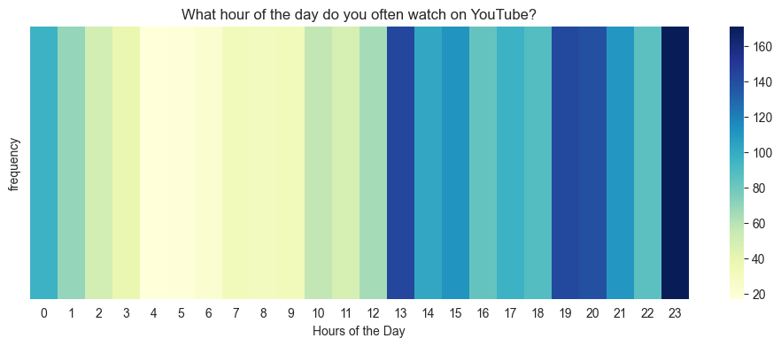

# Youtube Watch History Data to CSV file

This python script extracts data from an HTML file, provided by Google Takeout, that contains the user's YouTube Watch History, including all of the videos watched with their titles and URLs, the uploader's channel and its URL, and the time they were viewed on YouTube. It will all be stored in a CSV file with additional information for each video, such as its duration, like count, comment count, and description, with the help of the YouTube API. 

The implementation of general descriptive approaches to the output data will provide a comprehensive findings of YouTube usage habits.


## With this CSV file in hand, you can perform your own analysis and discover your viewing preferences and usage patterns based on your YouTube history data.


### Notable insights you can derive from the output file👀✨:


#### Your YouTube usage patterns
Sample graph displaying the total number of watch/view times per hour.



#### Type of contents you are most engaged with and enjoy the most.
Sample graph categorizing the types of content typically watched/listened to


#### Check out my full analysis of my output data [here](https://github.com/Johncarlodeveloper/YouTube-History-Data-Analysis/blob/main/history_analysis.ipynb).


### Extraction Process

1. **Google Takeout**:
    - The initial dataset was downloaded from Google Takeout, which provided an HMTL file containing basic information about each video watched, including the video title, timestamp, link, and channel name.

2. **YouTube API**:
    - Using the video IDs extracted from the Google Takeout dataset, the YouTube Data API was used to retrieve additional information. 
    - A script was written in Python to interact with the YouTube Data API. This script performed the following steps:
        1. **Authenticate**: Connect to the YouTube Data API using an API key.
        2. **Request Data**: For each video ID, send a request to the YouTube API to fetch video details.
        3. **Parse Response**: Extract relevant information from the API response, such as video tags, number of likes, number of comments, and other metadata.
        4. **Merge Data**: Combine the additional information from the YouTube API with the original Google Takeout data to create a more comprehensive dataset and output it in a CSV file.

## How to Use

**Step 1: Download YouTube Watch History Data**
- Go to [Google Takeout](https://takeout.google.com/).
- Select and download your YouTube data archive. Ensure it is in HTML file format.
- Locate the downloaded file in your computer's directory.
- Find the HTML file named 'watch-history.html' within the archive.

**Step 2: Set Up YouTube API Access**
- Go to [YouTube Data API documentation](https://developers.google.com/youtube/v3/getting-started).
- Follow the instructions to create and obtain your API key.
- Make sure to enable the YouTube Data API for your project.

**Step 3: Clone and Set Up the Repository**

# Run Locally

Clone the project

```bash
  git clone https://github.com/Johncarlodeveloper/youtube_watch_history_data_to_csv_file
```

Go to the project directory

```bash
  cd youtube_watch_history_data_to_csv_file
```

Install dependencies

```bash
  pip install -r requirements.txt
```

Input your API key into the source code.

```bash
  API_KEY = "<API KEY HERE>"
```
Input the path of HTML file.

```bash
  html_file_path = "<PATH HERE>"
```

Run the Python Script:

```bash
  python project.py
```

The data extraction process time varies depending on the size of your YouTube watch history data. This may take up to more than 10 minutes.


